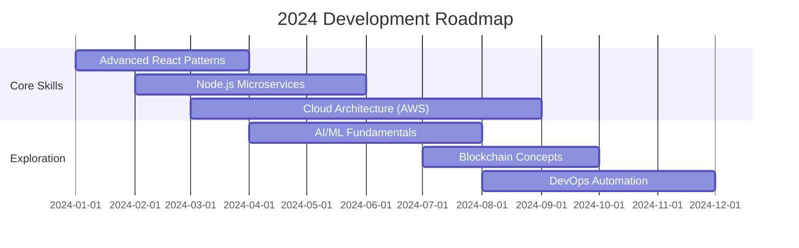

# ✨ Pasan Athuluwage | Professional Full Stack Developer

  
   
  <strong>Full Stack Developer | UI/UX Enthusiast | Tech Innovator</strong>

  
  
  
  

   
  

---

## 🚀 About Me

I'm a passionate Full Stack Developer with expertise in modern web technologies and a keen eye for UI/UX design. Currently focusing on building scalable applications with React, Node.js, and cloud technologies while exploring the frontiers of AI and DevOps.

- 🔭 **Currently working on:** React, Node.js, Laravel & Flutter projects
- 🌱 **Currently learning:** Cloud Computing & DevOps practices
- 🎨 **Design passion:** UI/UX design enthusiast & Figma creator
- 💡 **Exploring:** AI, Data Science & Blockchain technologies
- 🏆 **Achievement:** Competed in TECH-TRIATHLON by DESIGNATHON to innovate Sri Lankan tourism
- 🎯 **Goal:** Building seamless digital experiences that solve real-world problems

---

## 🛠️ Tech Stack

### **Frontend Development**

### **Backend Development**

### **Databases**

### **DevOps & Tools**

### **Design & UI/UX**

---

## 📊 GitHub Analytics

  
   

  <table border="0">
  <tr>
    <td width="50%">
      
    </td>
    <td width="50%">
  
    </td>
  </tr>
</table>

---

## 📌 Highlights

- 🚀 **Top Contributed Projects**
  
  

- 🧠 **Repo Summary**

<table border="0">
  <tr>
    <td width="50%">
      
    </td>
    <td width="50%">
  
    </td>
  </tr>
</table>

---

## 🏆 Recent Highlights

### **Featured Projects**
- **E-Commerce Platform** – Full-stack React/Node.js with microservices architecture
- **Tourism Innovation App** – Flutter-based solution for Sri Lankan tourism (Designathon finalist)
- **CRM Dashboard** – Laravel/React admin dashboard with real-time analytics
- **UI Component Library** – Custom React components with Storybook documentation

### **Open Source Contributions**
- Regular contributor to React ecosystem libraries
- Maintaining several utility packages on npm
- Active in tech community discussions and code reviews

### **Certifications & Awards**
- TECH-TRIATHLON Designathon Finalist
- AWS Cloud Practitioner (In progress)
- React Advanced Patterns certification

---

## 📈 Current Focus

---

## 📫 Let's Connect

I'm always open to discussing exciting projects, collaboration opportunities, or just having a friendly chat about technology!

  
  
  
  
  
  
    
  
  

---

  <i>"Let your code tell your story. Build with passion, design with purpose, and innovate without limits."</i>
   
  <strong>🚀 Let's build something amazing together!</strong>

  
  
  

---

*Last Updated: Dec 2025  | *Crafted with ❤️ and GitHub Markdown**
